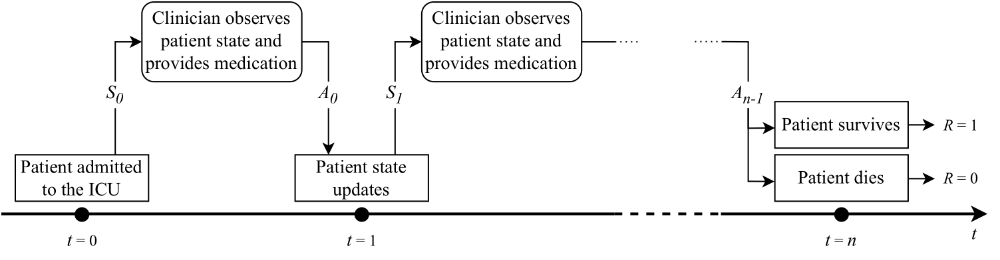

# The ICU-Sepsis Environment

The **ICU-Sepsis** environment is a reinforcement learning environment that
simulates the treatment of sepsis in an intensive care unit (ICU). The
environment is introduced in the paper
[ICU-Sepsis: A Benchmark MDP Built from Real Medical Data](https://arxiv.org/abs/2406.05646),
accepted at the Reinforcement Learning Conference, 2024. ICU-Sepsis is built
using the [MIMIC-III Dataset](https://physionet.org/content/mimiciii/1.4/),
based on the work of
[Komorowski et al. (2018)](https://www.nature.com/articles/s41591-018-0213-5).



Citation:
```bibtex
@inproceedings{
  choudhary2024icusepsis,
  title={{ICU-Sepsis}: A Benchmark {MDP} Built from Real Medical Data},
  author={Kartik Choudhary and Dhawal Gupta and Philip S. Thomas},
  booktitle={Reinforcement Learning Conference},
  year={2024},
  url={https://arxiv.org/abs/2406.05646}
}
```

## Environment description

ICU-Sepsis is a tabular MDP with $N_S = 716$ states ($\\{0,1,\dots,715\\}$) and $N_A = 25$ actions ($\\{0,1,\dots,24\\}$).
Each episode simulates the treatment of one sepsis patient in the ICU.

An episode ends when the patient survives (state $714$) and gets a reward of `+1`, or dies (state $713$) and gets a reward
of `0`, while all the intermediate rewards are `0`. The discount factor is set as $\gamma = 1$.

## Baselines

Some baseline results are shown below as a reference.

<table>
  <tr>
    <th></th>
    <th>Random</th>
    <th>Expert</th>
    <th>Optimal</th>
  </tr>
  <tr>
    <th>Avg. return</th>
    <td>0.78</td>
    <td>0.78</td>
    <td>0.88</td>
  </tr>
  <tr>
    <th>Avg. episode length</th>
    <td>9.45</td>
    <td>9.22</td>
    <td>10.99</td>
  </tr>
</table>

The three baseline policies used are:
1. **Random:** Each action is taken uniformly randomly out of all the actions in any given state.
2. **Expert:** The estimated policy used by clinicians in the real world, computed using the data from the MIMIC-III dataset.
3. **Optimal:** Optimal policy computed using value iteration (requires knowledge of the transition parameters).

## Admissible actions

In the MIMIC-III dataset, not all actions are taken enough times in each state
to reliably estimate the transition probabilities, and such actions are
considered inadmissible. To deal with this issue, the transition probabilities
for inadmissible actions are set to the mean of the transition probabilities of
all admissible actions in the state. This way, the environment can be used with
all actions in all states. This is an implementation detail and does not need to
be considered for normal use. See the paper for more details.

## Model parameters

In addition to the Python implementation of the environment using the [Gym](https://www.gymlibrary.dev/) and
[Gymnasium](https://gymnasium.farama.org/) libraries (see below), the model parameters are also provided as CSV files
in the `icu-sepsis-csv-tables.tar.gz` archive which contains the following files:

1. `transitionFunction.csv`: The transition table with $N_S \times N_A$ rows and $N_S$ columns. The transition probability $p(s_i,a,s_f)$
   is given in the $s_f^{\text{th}}$ column of the $(s_i \times N_A + a)^{\text{th}}$ row.
2. `rewardFunction.csv`: The reward table with $1$ row and $N_S$ columns. Since the reward after any transition is a deterministic function
   of the state being transitioned into, the reward $R(s_i,a,s_f)$ is present in the $s_f^{\text{th}}$ column.
3. `initialStateDistribution.csv`: The initial-state distribution table with $1$ row and $N_S$ columns. The initial-state probability $d_0(s)$
   of the state $s$ is present in the $s^{\text{th}}$ column.
4. `expertPolicy.csv`: The expert policy table with $N_S$ rows and $N_A$ columns containing the estimated policy $\pi_{\text{expert}}$ used
   by the clinicians. The probability $\pi_{\text{expert}}(s, a)$ is present in the $a^{\text{th}}$ column of the $s^{\text{th}}$ row.

The following extra files are not required for the environment but are provided for reference in the `extras/` directory:
1. `admissibleActions.txt`: The list of admissible actions for each state. The first line contains the space-separated list
   of number of admissible actions for each state, and the subsequent lines contain the space-separated list of admissible actions
   for each state.
2. `stateClusterCenters.csv`: The cluster centers of the states in the normalized continuous feature space.
3. `sofaScores.csv`: The average [SOFA scores](https://files.asprtracie.hhs.gov/documents/aspr-tracie-sofa-score-fact-sheet.pdf) for each state based on the MIMIC-III dataset.

## Python installation and quickstart

ICU-Sepsis can be used with Python `3.10` or later, with gymnasium `0.28.1` or
later, and gym `0.21.0` or later.


### Installation with pip

The environment can be installed using the `pip` command:

```bash
pip install icu-sepsis
```

### Installation from source

To install the environment from source, clone the repository and navigate to
the `packages` directory, and install the `icu_sepsis` package locally:

```bash
git clone https://github.com/icu-sepsis/icu-sepsis.git
cd icu-sepsis/packages/
pip install icu_sepsis/
```

### Uninstalling

To uninstall, use the `pip uninstall` command:

```bash
pip uninstall icu_sepsis -y
```

### Quickstart

The environment can be loaded with the Gym or Gymnasium packages and follows
the standard Gym API. The following code snippet demonstrates how to create
the environment, reset it, and take a step:

```python
import gymnasium as gym
import icu_sepsis

env = gym.make('Sepsis/ICU-Sepsis-v2')

state, info = env.reset()
print('Initial state:', state)
print('Extra info:', info)

next_state, reward, terminated, truncated, info = env.step(0)
print('\nTaking action 0:')
print('Next state:', next_state)
print('Reward:', reward)
print('Terminated:', terminated)
print('Truncated:', truncated)
```

You can also run the script `examples/quickstart.py` to verify that the
installation was successful.

### Version 2 changes

As mentioned previously, not all actions are admissible in all states, so the
transition probabilities for inadmissible actions are set to the mean of the
transition probabilities of all admissible actions in the state. This was the
only mode of operation in version 1, and all the baseline numbers are based on
this mode.

In version 2, this mode remains the default, so creating the environment with
`gym.make('Sepsis/ICU-Sepsis-v2')` without providing any additional arguments
is equivalent to the version 1 behavior.

However, in version 2, the environment creation can take an optional argument
`inadmissible_action_strategy` which can be set to the following values:

1. `'mean'` (default): The transition probabilities for inadmissible actions
   are set to the mean of the transition probabilities of all admissible actions
   in the state.
2. `'terminate'`: The environment terminates the episode if an inadmissible
   action is taken in any state, and the patient is sent to the "death" state.
3. `'raise_exception'`: The environment raises an exception if an inadmissible
   action is taken in any state.

## Experiments

The code for running the experiments shown in the paper can be viewed at [this repository](https://github.com/Dhawgupta/choudhary2024icu).

## Reproducing the environment parameters

The optional helper library can be installed locally by cloning the repository,
and installing the `icu_sepsis_helpers` package in the `packages` directory:

```bash
git clone https://github.com/icu-sepsis/icu-sepsis.git
cd icu-sepsis/packages/
pip install icu_sepsis_helpers/
```

This library provides a set of helper functions to re-create the environment
parameters from scratch using the 
[MIMIC-III Dataset](https://physionet.org/content/mimiciii/1.4/) and the scripts
by
[Komorowski et al. (2018)](https://github.com/matthieukomorowski/AI_Clinician).

First, the data extraction and identification of the sepsis cohort is done
using the `AIClinician_Data_extract_MIMIC3_140219.ipynb` and
`AIClinician_sepsis3_def_160219.m` scripts from the
[AI Clinician repository](https://github.com/matthieukomorowski/AI_Clinician).

Then, the `build.py` script in the `icu_sepsis_helpers` package can be used to
create the environment parameters using the created sepsis cohort.

For convenience, the `examples/build_mimic_demo.py` script can be used to
create the environment parameters and save them to disk.

Baselines can be computed using the `examples/get_baselines.py` script.

